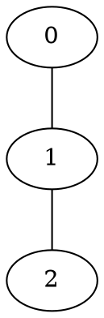

# Popnet Chiplet 2.0

Popnet Chiplet is a cycle-driven network-on-chip and chiplet-network simulator. This version keeps
the existing command-line interface, JSON configuration keys, routing modes, trace formats,
topology/reconfiguration formats, delay records, and power reports while rebuilding the simulator
as a tested C++20 project.

## Requirements

- Linux or another POSIX environment (`getopt` is used by the legacy-compatible CLI)
- CMake 3.20 or newer
- A C++20 compiler and a C11 compiler
- Boost 1.74 or newer with Graph, Iostreams, Regex, Serialization, and Filesystem
- Make, if the convenience targets are used

On Debian or Ubuntu, the external build dependencies can be installed with:

```sh
sudo apt-get install build-essential cmake libboost-all-dev
```

fmt, nlohmann/json, Orion, and the graph wrapper are included under `thirdparty/`.

## Build And Run

```sh
cmake -S . -B build -DCMAKE_BUILD_TYPE=Release
cmake --build build --parallel
./build/popnet -JSON ./config.json
```

The Makefile exposes the same workflow:

```sh
make build
make run ARGS="-JSON ./config.json"
```

When `ARGS` is omitted, `make run` uses `-JSON ./config.json`. A custom Boost installation can be
selected with CMake's standard `-DCMAKE_PREFIX_PATH=/path/to/prefix` option.

## Project Layout

```text
app/                    executable entry point
include/popnet/         public simulator headers
src/                    simulator implementations
  alg/                  shortest-path table construction
  global_defines/       events, packets, traces, protocol state, and RNG
  io/                   delay-file output
  preprocess/           CLI and JSON configuration
  router/               router pipeline, routing policies, buffers, and power accounting
  sim/                  simulation orchestration and owned run state
tests/                  unit, integration, golden, and format fixtures
thirdparty/             vendored dependencies
```

`Popnet::Core` is a reusable static-library CMake target. The `popnet` executable is a thin adapter
that parses configuration, runs `Sim`, and reports results. `Sim` owns the configuration and run
state behind a small interface; event scheduling, trace parsing, protocol lookup, delay formatting,
router storage, and power accounting are separate testable modules. Orion details are private to the
power module and do not leak through public headers.

## Configuration

JSON mode is selected only by the existing three-argument form:

```sh
./build/popnet -JSON path/to/config.json
```

Alternatively, use the existing command-line flags. JSON and individual flags are not combined.

| JSON key | CLI | Default | Meaning |
| --- | --- | ---: | --- |
| `vertices` | `-A` | `8` | Routers per dimension |
| `dimension` | `-c` | `2` | Address dimensions |
| `vc_cnt` | `-V` | `2` | Virtual channels per physical port |
| `input_buffer` | `-B` | `64` | Input VC capacity |
| `output_buffer` | `-O` | `4` | Output-port capacity |
| `flit_size` | `-F` | `4` | Flit width in simulator atoms |
| `link_length` | `-L` | `1000` | Orion link length |
| `time` | `-T` | `1000000000` | Simulation time limit |
| `trace_file` | `-I` | required | Input trace path |
| `random_seed` | `-r` | random | Per-simulation RNG seed |
| `routing_algorithm` | `-R` | `0` | Routing name or numeric ID |
| `topology_file` | `-G` | empty | DOT topology path |
| `report_period` | `-m` | `2000` | Report interval |
| `reconfig_file` | `-C` | empty | Reconfiguration path |
| `packet_loss` | `-l` | `false` | Enable full-buffer packet dropping |
| `delay_file` | `-D` | timestamped | Delay-record path |
| `protocol_enable` | `-P` | `false` | Parse protocol trace records |
| `end_with_-1` | `-E` | `false` | Follow a growing trace until `-1` |
| `log_file` | JSON only | timestamped | Simulator log and final report path |

Boolean CLI options are switches and take no value. `-h` prints the legacy help text. Timestamped
files are created under `logs/`. Delay output is opened in append mode, preserving the original
behavior.

Values are validated before simulation. Counts and buffer sizes must be positive, time and lengths
must be finite and non-negative, the report period must be positive, and
`physical_ports * vc_cnt` must not exceed 64.

## Routing Modes

| ID | JSON name | Constraint |
| ---: | --- | --- |
| `0` | `XY` | Generic dimension-ordered routing |
| `1` | `TXY` | Existing TXY routing |
| `2` | `CHIPLET_ROUTING_MESH` | `dimension == 4` |
| `3` | `CHIPLET_STAR_TOPO_ROUTING` | `dimension == 4` |
| `4` | `GRAPH_TOPO` | `dimension == 1`; topology required |
| `5` | `RECONFIGURABLE_GRAPH_TOPO` | `dimension == 1`; topology and reconfiguration required |

For graph modes, `vertices^dimension` must equal the topology's vertex count. Graph vertex names
must be contiguous numeric addresses from `0` through `N - 1`.

## Trace Formats

Whitespace separates all fields. An address contains exactly `dimension` integer coordinates.

Normal traffic:

```text
start_time src[0] ... src[D-1] dst[0] ... dst[D-1] packet_size
```

Protocol traffic (`protocol_enable` / `-P`):

```text
src_time dst_time src[0] ... src[D-1] dst[0] ... dst[D-1] packet_size protocol_descriptor
```

Records may end with a line containing `-1`. Without `end_with_-1`, EOF completes the trace. With
`end_with_-1`, the simulator follows a growing file, polls incomplete input, and stops only after the
sentinel appears. Malformed completed records fail with their byte offset instead of being silently
accepted.

## Topology Format

Graph modes read an undirected Graphviz DOT file. The recognized attributes are:

- Node: `pipeline_stage_delay`, `energy_per_forwarding`, `in_traffic`, `out_traffic`
- Edge: `weight` for delay, `energy_per_hop`, and optional `id`

Example:



Every pipeline delay must be finite and greater than zero.

## Reconfiguration Format

The first line declares the number of periods, the period duration, and the number of routers that
receive reconfigurable ports. It is followed by those router IDs and then one flow block per period:

```text
period_count reconfiguration_period reconfigurable_router_count
router_id_0 ... router_id_N-1
flow_count_for_period_0
source destination delay
...
flow_count_for_period_1
...
```

Each period starts from the base DOT topology and adds the listed undirected links. See
`tests/fixtures/line_3.reconfig` for a complete example.

## Output Formats

For normal traffic, each completed packet appends one delay line:

```text
integer_start_time src[0] ... src[D-1] dst[0] ... dst[D-1] delay
```

Protocol mode preserves its two existing record forms:

```text
integer_src_time src[...] dst[...] protocol_descriptor 2 injection_delay -1
integer_src_time src[...] dst[...] protocol_descriptor delay_count delay_0 ... delay_N-1
```

The log contains configuration, event diagnostics, and the final totals for completed packets,
average delay, buffer power, crossbar power, arbiter power, link power, and total power.

## Tests

Tests are enabled by default and require no external test framework:

```sh
cmake -S . -B build-test -DCMAKE_BUILD_TYPE=Debug
cmake --build build-test --parallel
ctest --test-dir build-test --output-on-failure
```

The suite covers deterministic event phases, normal and protocol parsing, configuration and
validation, protocol lookup, flattened buffers and credits, Orion storage bounds, exact delay text,
topology and reconfiguration, RNG/run isolation, packet loss, source-local timing, every routing
mode, empty traces, protocol completion, single-use simulations, and a fixed-seed golden result.

AddressSanitizer and UndefinedBehaviorSanitizer can be run with:

```sh
cmake -S . -B build-san -DCMAKE_BUILD_TYPE=Debug \
    -DPOPNET_BUILD_TESTS=ON -DPOPNET_ENABLE_SANITIZERS=ON
cmake --build build-san --parallel
ctest --test-dir build-san --output-on-failure
```

The equivalent convenience command is `make check`.

## Performance And Compatibility

The main performance changes are contiguous per-channel state, `std::deque` FIFO buffers, moved
flits, reused arbitration storage, indexed protocol lookup, deterministic per-type event heaps, and
arithmetic fast-forwarding across idle router cycles.

On the included 9x9 XY workload (`tests/random_trace/bench`, seed 1, 11,983 packets), one local
end-to-end run with debug logging enabled measured:

| Build | Elapsed | Packets | Average delay |
| --- | ---: | ---: | ---: |
| Legacy with only the source-timing bug corrected | `3.72 s` | `11,983` | `35.585984553117` |
| Modern C++20 build | `1.06 s` | `11,983` | `35.586068004673` |

That is a 3.51x speedup and a 71.5% wall-time reduction. Results depend on hardware and logging
volume; use `/usr/bin/time ./build/popnet -JSON ./config.json` to reproduce the measurement.

Equal-time events now have an explicit legacy-observed phase order:

```text
CREDIT -> WIRE -> RECONFIGURATION -> ROUTER -> EVG
```

The corrected legacy and modern benchmark differ for 13 late packets by one aggregate cycle
(`0.000083451556` average). Legacy same-type heap ties were unspecified; the modern queue makes them
stable by insertion sequence. Reconfiguration ordering is now explicitly tested because the legacy
simulator failed to schedule its initial reconfiguration event and therefore provided no reliable
tie-order behavior for that phase.

Historical documentation is retained under `docs/`.
